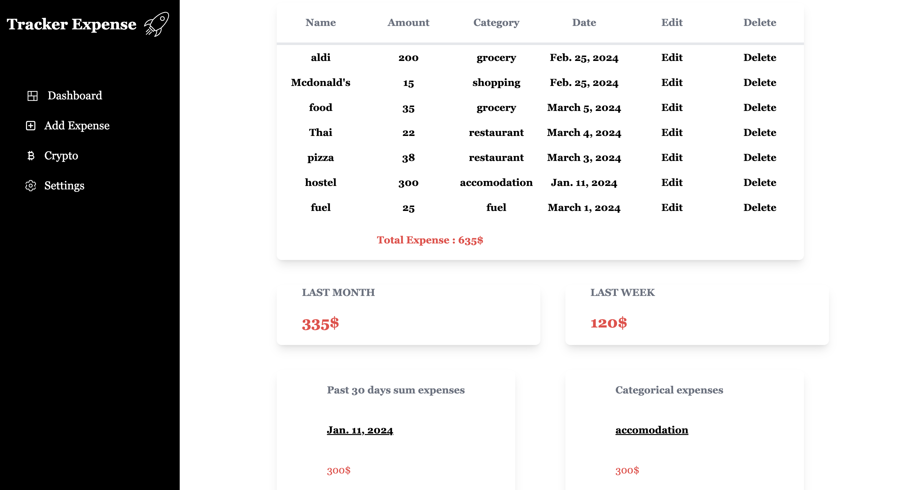

# Expense Tracker Django website

This is a Expense Tracker website built with Django, javascript and tailwind.
You need to have python installed.

Website purpose : practice


KEY FEATURES :

Integration of Tailwind CSS for design and styling.


- Finance App:
Integration of Chart.js for data visualization.
Expense model to record expenses.
Category model for categorizing expenses.
Adding expenses.
Adding categories.
Viewing expense details.

- Crypto App:
API call to retrieve the current price of cryptocurrencies.
Viewing owned cryptocurrencies.
Adding cryptocurrencies.
Viewing details (profit, current price, sorting features, etc.).


```bash
```


# Install 
```bash
git clone https://github.com/sam-gvt/tracker_expense_django.git

pip install -r requirements.txt
```


# Create your database
```bash
python manage.py makemigrations
python manage.py migrate
```

# Start server 
```bash
python manage.py runserver
```

## License

[MIT](https://choosealicense.com/licenses/mit/)